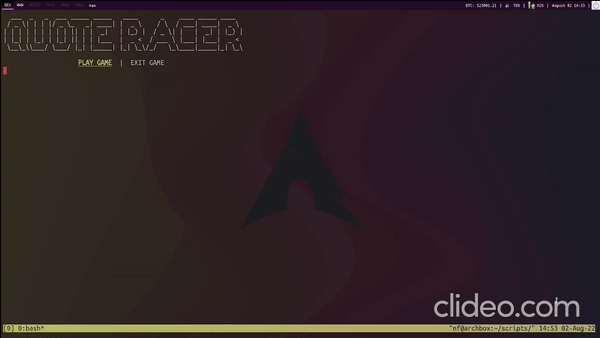

# Quote Racer


## Requirements
Requirement programs to run the shell script are `python3` and `figlet`.  

## Usage Commands
In order to navigate the menu, use vim keys `h` and `l` and `s` to select 
desired option.   

## Add Quotes
The quotes are stored in the file `quotes.txt` in the following way:  
Odd and even numbers are used to detect quotes and their author, quotes being 
odd numbers and their respective author in the next line with even numbers.  
**Example:**  
```
I'm selfish, impatient and a little insecure. I make mistakes, I am out of control and at times hard to handle. But if you can't handle me at my worst, then you sure as hell don't deserve me at my best.
Marilyn Monroe
Be yourself; everyone else is already taken.
Oscar Wilde
Two things are infinite: the universe and human stupidity; and I'm not sure about the universe.
Albert Einstein
```
To add more quotes, just add them to the previous file as described.  
  


